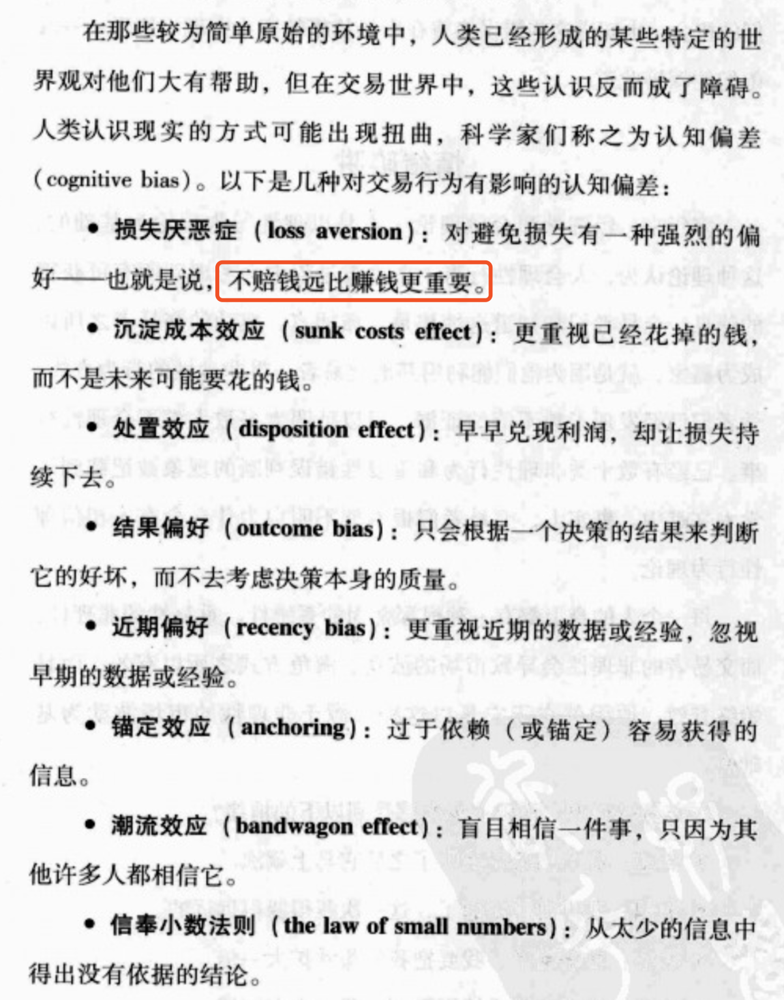

背景介绍：理查德·丹尼斯花了两周时间培训，毫无保留教授他们[期货交易](https://baike.baidu.com/item/期货交易)的基本概念，以及他自己的交易方法和原则。他教导学生追求趋势，先分析决定市场是[多头](https://baike.baidu.com/item/多头)还是空头，[进场交易](https://baike.baidu.com/item/进场交易/5599392)时必须做好[资金管理](https://baike.baidu.com/item/资金管理)，适当控制买卖单量，并选择时机获利出场。理查德·丹尼斯在亚洲参观一家水产养殖场时发现该场繁殖海龟很有一套，回来后一时兴起称他的徒儿们为“海龟”。课程结束后，理查德·丹尼斯给每人一个10万美元的账户进行实战练习。这些海龟还真争气，在4年的训练课程中，23名学生有3人退出，其余20人其余都有上乘表现，平均每年[收益率](https://baike.baidu.com/item/收益率)在100%左右，而他付给这些学生20%的分红就达3000-3500万美元，其中最成功的一名学生，4年下来替理查德·丹尼斯赚了3150万美元。名声传出去后许多大基金会纷纷出高薪来挖人，如今大部分“海龟们”要么被挖走，要么拉出去单干，手头都控制着上亿元[美金](https://baike.baidu.com/item/美金/4309458)，成为[期货](https://baike.baidu.com/item/期货)市场的一支生力军。“海龟”的名声也越叫越响。结果证实理查德·丹尼斯的观点是正确的：成功的交易者是可以通过训练与学习而得的，这无关乎聪明才智，全在于交易者的方法、原则。

提到书籍：《股票作手回忆录》（Reminiscences of a stock operator）

头寸规模法则

交易心理决定了结果差异

风险心理学一个结论：人类会在决策过程中走很多捷径，正是这一点使人类变成了非常无效率的决策者。

投资者与交易者的差别：投资者买东西是为了长远目标，他们相信，在一段相当长的时间之后，他们的投资会升值。他们买实物。沃伦·巴菲特就是个投资者，他买的是企业，不是股票。他买的是股票所代表的东西：企业本身，包括它的管理队伍、产品和市场地位。股票市场也许并不能反映他的企业的“正确”价值，但他不在意。事实上，他正是靠这一点赚钱的。他会在股票市场严重低估了企业价值的时候买入企业，然后在股票市场大大高估了企业价值的时候卖出企业。他通过这种方式大发横财，因为他精于此道。

交易者不买实物，只关系价格，从本质上说，他们买卖的是风险。

通过买卖期货合约来抵消原材料价格变化或外汇波动所带来的经营风险，这种做法叫做对冲。西南航空公司一直擅长刺刀，当石油价格从25美元一桶上升到60美元时，公司的成本并没有太大的提高。它的保值策略相当成功，甚至在油价上涨多年之后，它的油料中仍有85%是以每桶26美元买入的。

那么是谁把期货合约卖给它们的？是交易者。

两大类风险：流动风险和价格风险。很多交易者是短线操作者，他们经营的就是人们所说的流动性风险（指无法买入或卖出的风险）。

买入价(bid)和卖出价(ask)

这类交易有一个叫做套利(arbitrage)的变种。套利交易涉及**两个不同市场**的流动性。套利交易者可能在伦敦买入原油，同时在纽约卖出原油；或者买入一个股票组合，同时卖出代表类似股票组合的股指期货。

对冲者们通过把风险转移给交易者来规避价格风险。经营这种价格风险的交易者们被称作投机商（speculator）或头寸交易商（position trader）。投机商们靠价格的变化赚钱；先买入，然后等价格上涨时卖出；或者先卖出，然后等价格下降时买回平仓——这种交易被称作卖空。

### 期货合约

期货合约是买方同意在一段指定时间之后按特定价格接收某种资产，卖方同意在一段指定时间之后按特定价格交付某种资产的协议。双方同意将来交易时使用的价格称为期货价格。双方将来必须进行交易的指定日期称为结算日或交割日。双方同意交换的资产称为“标的”。如果投资者通过买入期货合约（即同意在将来日期买入）在市场上取得一个头寸，称多头头寸或在期货上做多。相反，如果投资者取得的头寸是卖出期货合约（即承担将来卖出的合约责任），称空头头寸或在期货上做空。

期货合约的细节是由交易所规定的，全都写在一份叫做合约规格（contract specification）的文件里。这些文件规定了一份合约所代表的货物数量和种类，有时候还规定了某种特定商品的质量。在过去，一份合约的货物量是根据一节车皮的承载量来决定的：5000蒲式耳（英美管用的体积或容积单位，1蒲式耳约为36.37升）谷物，1000桶油。合约有时候也被称作车皮。

交易以合约为单位：你的交易量不能小于一份合约。交易所的合约规格也规定了价格的最小变动幅度，在业内被称为一个单位(tick)或最小单位(minimum tick)

举例：

根据芝加哥商业交易所的规定，一份英镑合约代表62500英镑，最小价格单位是1/100美分，也就是0.0001美元。所以，每一单位的价格变动价值为6.25美元。这意味着萨姆可以从每一个单位的价格差上赚到62.5美元，因为他卖出了10分合约。他向ACME公司出售这些合约的时候，买入价是1.845美元，卖出价是1.8452美元，价差两个单位。为了平仓，他会试着立刻以1.845美元的价格买入10份合约。如果成功地买入，他将会得到两个单位的利润，也就是100美元多一点。

艾斯正在抛空建仓，赌价格的下跌——这样的头寸被称为空头头寸(short position)。艾斯持有这个头寸的时间可能是10天也可能是10个月。

价格变动的背后机制：

假设A以1.8450美元的价格买回10份合约来平掉他的空头头寸，因为B正在提金融公司以1.8452美元的市场卖出价买入英镑合约。买的实在是太多了，以至于所有的场内交易商都开始紧张起来。尽管有些交易商可能持有多头头寸，但也有很多交易商可能已经卖空10份、20份甚至是100份合约，这意味着价格上涨会让他们赔钱。

（做空：金融资产的一种操作模式。与做多相对，做空是先借入标的资产，然后卖出获得现金，过一段时间之后，再支出现金买入标的资产归还。

做多：就是做多头，多头对市场判断是上涨，就会立即进行股票买入，所以做多就是买入股票、外汇或期货等。总体来说就是先买后卖。

）

如果有足够多的场内交易者持有空头头寸，却有一个大买单不期而至，恐慌可能出现。一个大卖家可能会把价格推高到一定的程度，引发其他一些预挂的买单成交，这回导致价格进一步上涨。处于这个原因，**有经验的帽客会在价格开始攀升的时候迅速退出空头头寸，只做多头的一边**。

（做空的交易者发现价格突然上升的时候）目睹这么多钱付诸东流的痛苦会让一个帽客不堪忍受，方寸大乱，惊慌失措地买入平仓，不管价格有多么高。在一个瞬息万变的市场中，这个变化可能只是一两分钟内的事；即使在一个较为温和的市场中，整个过程可能也只需要10~15分钟。

你会发现经验丰富的交易者不仅会早早地买入平仓，及时退出他们的空头头寸，还会**顺便多买一些**，转而做多，等待价格持续上涨。当经验不足的交易者在恐慌中盲目买入时，这些老练的交易者就有机会高价卖出，再赚一笔。

在交易世界里，人类的情绪既是机会值所在，也是最大的挑战。掌控了它，你就能成功。忽视了它，你就危险了。

要成为一个成功的交易者，你必须了解人类的情感。市场就是由一个个的人租场的，每一个人都有自己的希望、恐惧和弱点。作为一个交易者，你要从这些人类情感中寻找机会。幸运的是，一些非常聪明的人（行为金融学的先驱们）已经洞察到了人类情感对决策行为的影响。行为金融学这个领域引起人们的注意是从Robert Shiller的杰作《非理性繁荣》开始，在Hersh Shefrin的名著《超越贪婪与恐惧》中则得到了更为详尽的阐释。行为金融学可以帮助交易者和投资者们理解市场运行方式。

在紧张情绪中，人对风险和事件概率会做出糟糕的判断。有什么事能比赚钱或赔钱更令人紧张呢？行为金融学已经证明，当涉及这类利益问题的时候，人很少能做出完全理性的决策。成功的交易者理解这种现象，也能够从中获利。

每一个人的身上都有一种根深蒂固的系统性、重复性的非理性，而交易者的非理性会导致市场的波动。海龟方式之所有有效，而且始终有效，原因就在于它是以这种来源于非理性的市场波动为基础的。

患上损失厌恶症的人对避免损失由一种绝对的癖好，盈利只是第二位的。对大多数人来说，没有赚到100美元与损失了100美元并不是一回事。但是从理性角度来看，这两者是一回事：它们都代表这100美元没有盈利。研究表明，损失的心理影响可能比赢利大一倍

沉淀成本效应：

一个交易者给自己定损失10%就割肉，但是一旦损失到达10%时候，一般人会坚信只要他坚持不退出，他就会有机会等待市场反弹。沉淀成本效应会让决策变了味儿：他考虑的不是市场下一步会怎么变化，而是怎么想办法避免那10%打水漂。所以继续持有不是因为他相信市场会反弹，而是因为他不想接受损失。理性思维要求他退出，不管他最初对市场有什么样的假设，市场已经证明了他的错误，因为价格已经远远低于他最初定下的退出点。不幸的是，他想避免损失，但是损失更大、对于许多人来说，这种心理会继续下去，知道他们把所有的钱输个精光，或者终于在恐慌之中仓皇逃出，让账户赔掉30%~50%。

很多高科技公司的工程师手里有上市公司的股票期权。1999年~2000年初，他们目睹股价一天接一天地蹿升。当股价在2000年开始下跌时，我问许多朋友他们打算什么时候卖掉手中的股票，他们都说等价格回到X美元时候。而这个X要远高于当时的市价。结果，几乎每个人都眼看着她们的股票一路跌到了最初价值的1/10甚至1/100。价格越低，他们就越有理由等待——“我已经赔了200w，再陪几百美元算什么？”

结果偏好会导致人们过于重视实际发生的事情，忽视决策本身的质量。在交易世界中，即使是正确的方法也可能赔钱，甚至有可能连续赔钱。这些损失会导致交易者怀疑自己，怀疑自己的决策程序，于是对自己一直在使用的方法做出负面评价，因为这个方法的结果是负面的。再加上近期偏好，这个问题会变得尤其严重。

近期偏好指一个人更重视近期的数据和经验。昨天的一笔交易比上个星期或者上一年的交易重要。近期两个月的赔钱经历可能跟过去6个月的赚钱经历同样重要，甚至更加重要。于是近期一连串不成功的交易会导致交易者怀疑他们的方法和决策程序。

锚定效应：

